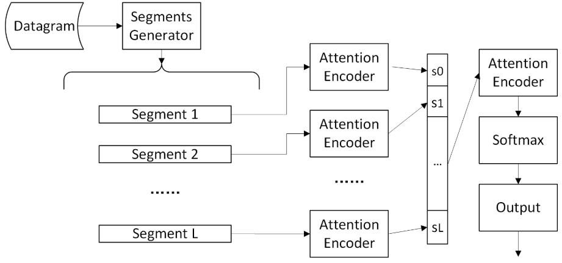

# BSSN
 A pytorch implementation of BSSN ( [Byte Segment Neural Network](http://iwqos2018.ieee-iwqos.org/files/2018/05/Byte_Segment_Neural_Network.pdf) ), which uses bidirectional GRU/LSTM unit with attention mechanism to classify network traffic into network protocols.
 BSSN structures:

